# Dracula userstyles

[Dracula](https://draculatheme.com) palettes for a few web apps, as [Stylus](https://github.com/openstyles/stylus) userstyles. Install Stylus, click an Install button below, confirm on the page Stylus opens. Stylus keeps the link as the update source and pulls new versions on its own whenever the file's `@version` goes up.

- [Claude](#claude)
- [Claude in Chrome glow](#claude-in-chrome-glow)
- [Figma](#figma)
- [Gmail](#gmail)
- [Klaviyo](#klaviyo)

## Claude

claude.ai in dark mode: chat, Claude Code, and the artifact viewer. Remaps the site's own colour ramps, so every surface, accent and status colour follows the palette, with a purple-to-navy page gradient.

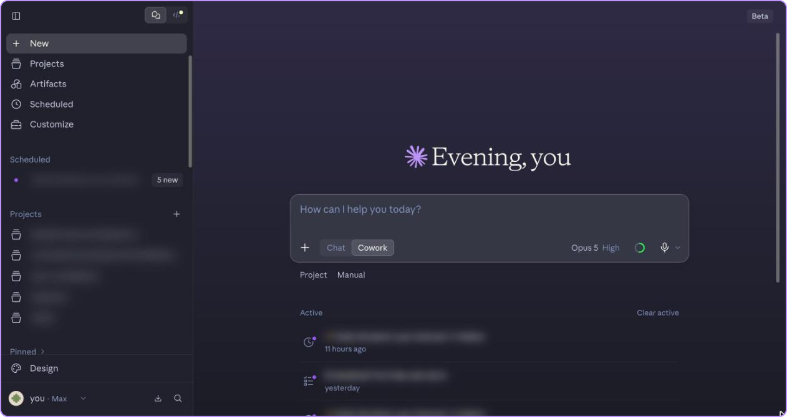

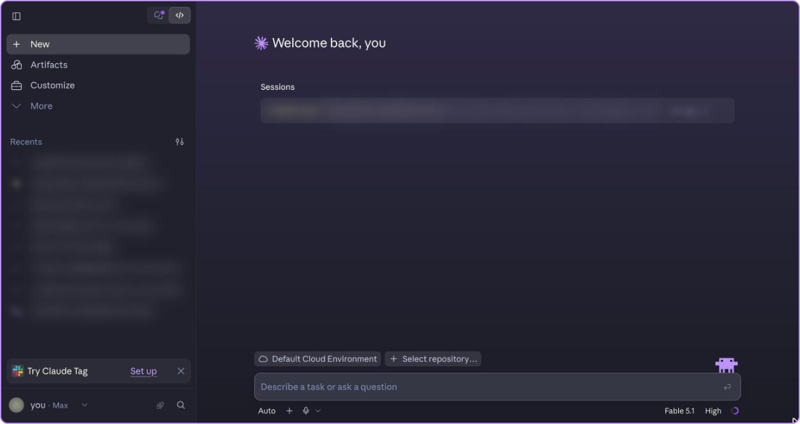

## Claude in Chrome glow

The border Claude in Chrome paints around a tab while it controls it, recoloured from brand orange to Dracula purple, along with its cursor, stop pill and tooltips.

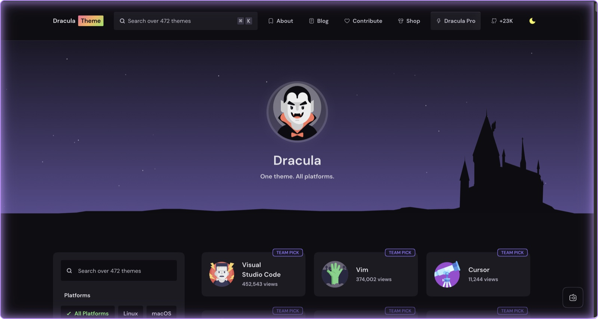

## Figma

figma.com in dark mode: the file browser, Design, FigJam, Slides, Make and Buzz. Remaps Figma's own colour ramps, so every surface follows the palette and each editor keeps its own accent: purple in Design, pink in FigJam, orange in Slides, cyan in Buzz. Canvas content is never recoloured.

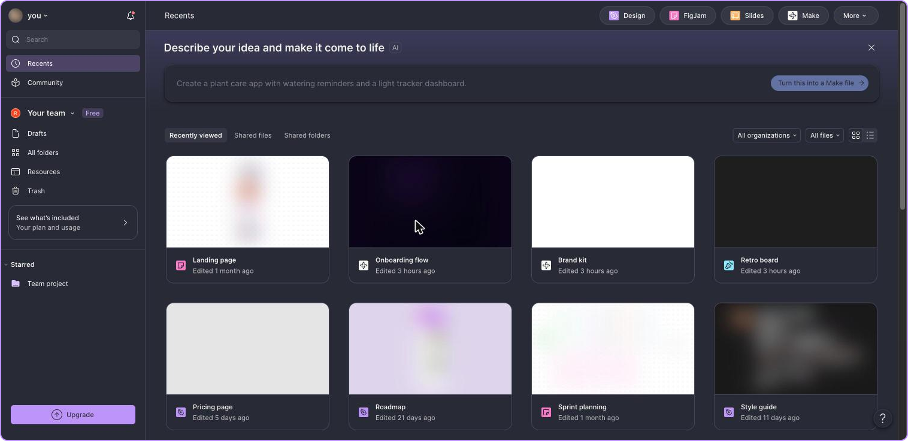

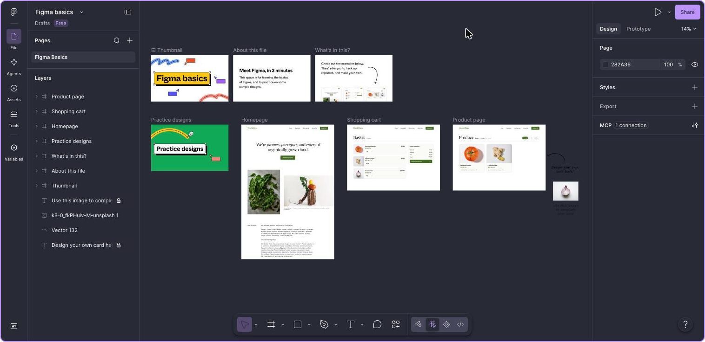

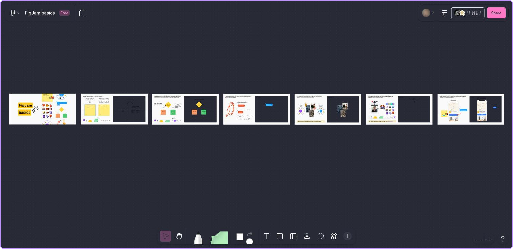

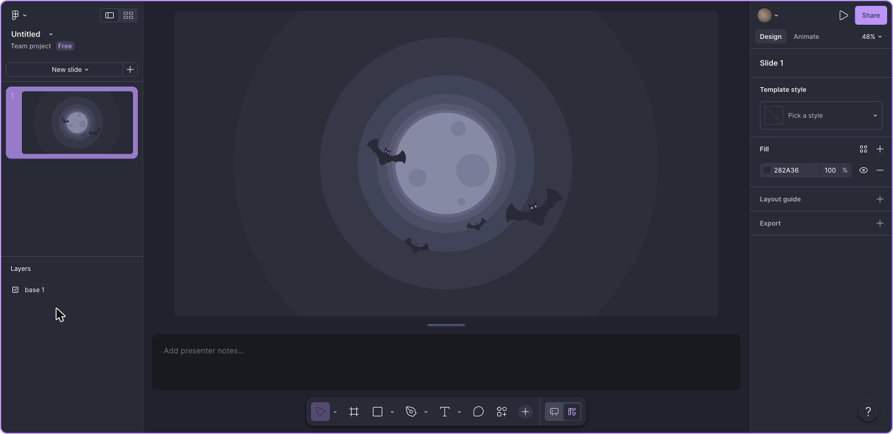

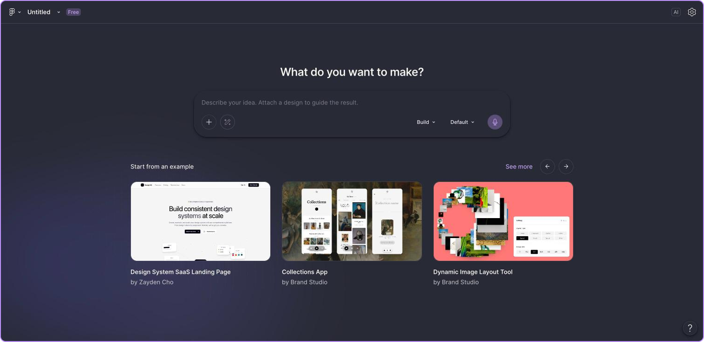

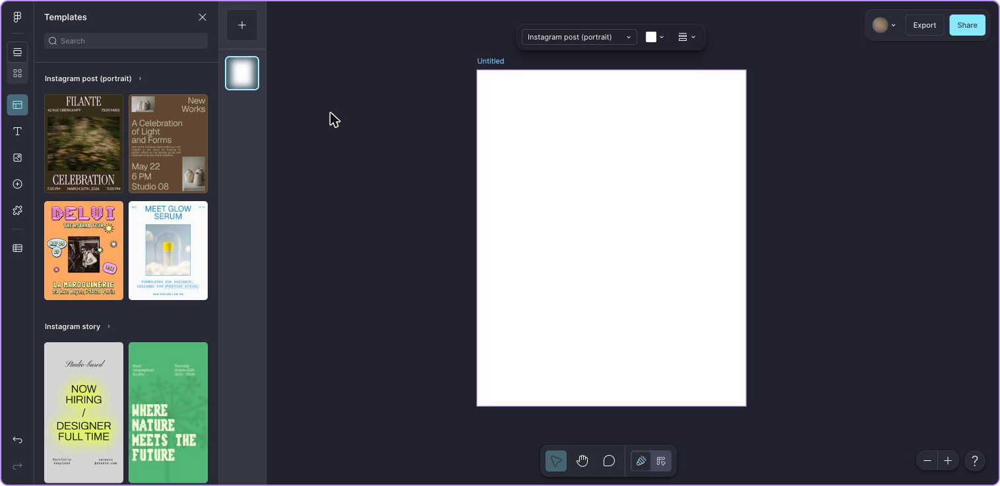

FigJam has no dark mode and its board is painted by Figma's WebGPU renderer, not by CSS, so the board needs a small companion userscript for [Tampermonkey](https://www.tampermonkey.net). It patches the dot-grid shader's background term and lowers the board greys so the board lands on the palette; content on the board is untouched. Chrome needs "Allow User Scripts" switched on in Tampermonkey's extension details.

## Gmail

Layers on Gmail's built-in Dark theme (Settings, Themes, Dark). Recolours the list, chrome and reading pane. Plain messages written by a person get a dark card with light text. Designed mail, such as newsletters and receipts, keeps its white card because its colours assume a white ground.

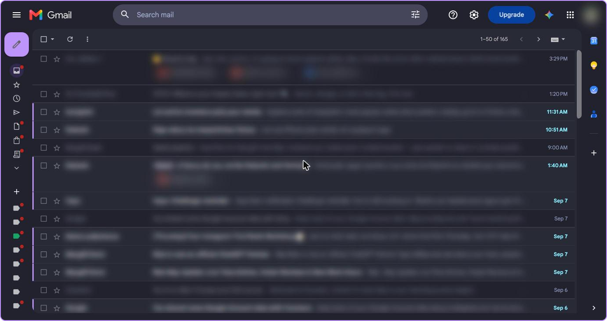

## Klaviyo

The Klaviyo app, built on Klaviyo's own design tokens so the theme follows its component semantics. The email template editor canvas is left untouched so your designs stay true.

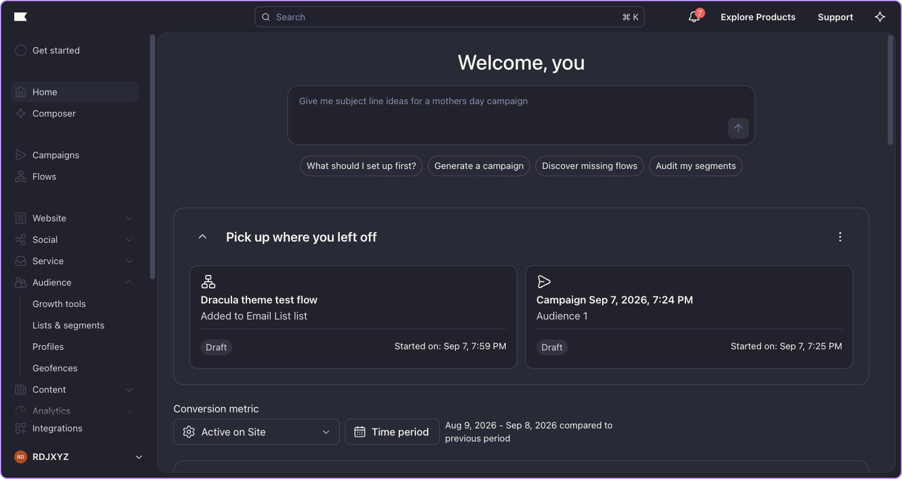

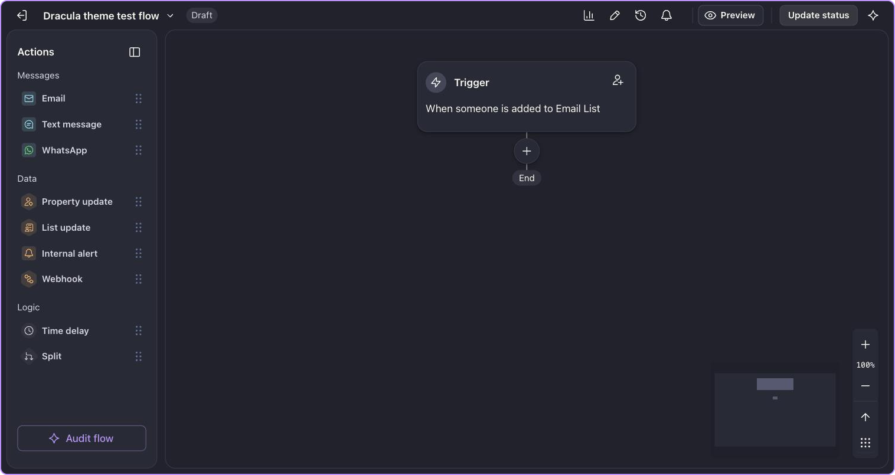

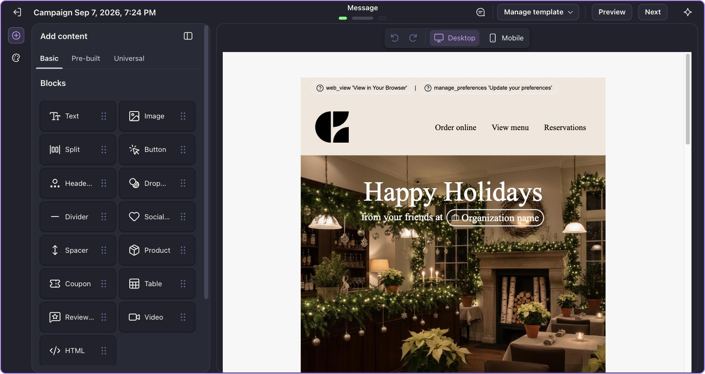

## Issues

Something off, or a site changed under a style? [Open an issue](https://github.com/rdjxyz/dracula-userstyles/issues/new). Say which style, the `@version` shown in Stylus (or Tampermonkey for the FigJam script), your browser, and a screenshot of the broken surface. The more details the better. Pull requests are welcome too.

## Updating

Stylus checks the install link about once a day and only pulls when the file's `@version` is higher than what's installed. To force it, open Stylus's manage page and click "Check all styles for updates".

MIT.
